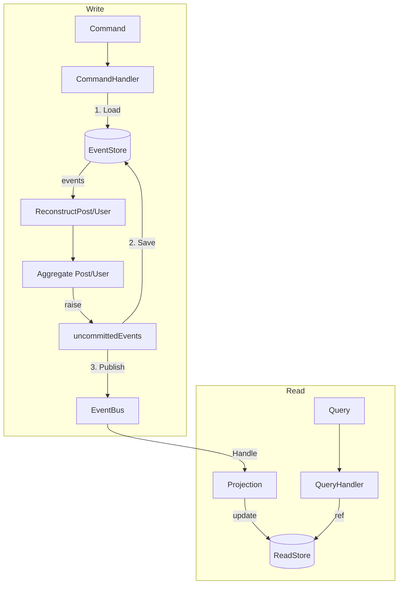
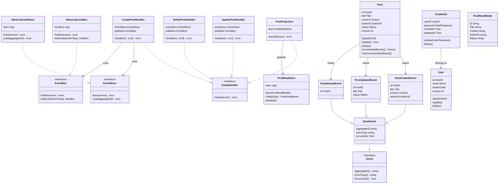

# CQRS + Event Sourcing

## アーキテクチャフロー

```mermaid
graph TD
    subgraph Write
        CMD[Command] --> CH[CommandHandler]
        CH -->|1. Load| ES[(EventStore)]
        ES -->|events| RC[ReconstructPost/User]
        RC --> AGG[Aggregate Post/User]
        AGG -->|raise| UE[uncommittedEvents]
        UE -->|2. Save| ES
        UE -->|3. Publish| EB[EventBus]
    end

    subgraph Read
        EB -->|Handle| PROJ[Projection]
        PROJ -->|update| RS[(ReadStore)]
        QH[QueryHandler] -->|ref| RS
        QRY[Query] --> QH
    end
```

## クラス図

```mermaid
classDiagram
    class Event {
        <<interface>>
        AggregateID() string
        EventType() string
        OccurredAt() Time
    }
    class BaseEvent {
        AggregateID string
        eventType string
        occurredAt Time
    }
    class EventStore {
        <<interface>>
        Save(events) error
        Load(aggregateID) error
    }
    class EventBus {
        <<interface>>
        Publish(event) error
        Subscribe(eventType, handler)
    }
    class EventHandler {
        <<interface>>
        Handle(event) error
    }
    class Post {
        id PostID
        title Title
        content Content
        authorID AuthorID
        status Status
        version int
        Apply(Event)
        Update() error
        Delete()
        UncommittedEvents() Events
        ClearUncommittedEvents()
    }
    class PostCreatedEvent {
        id PostID
        title Title
        content Content
        authorID AuthorID
    }
    class PostUpdatedEvent {
        id PostID
        title Title
        status Status
    }
    class PostDeletedEvent {
        id PostID
    }
    class User {
        id UserID
        name Name
        email Email
        version int
        Apply(Event)
        Update()
        Delete()
    }
    class Credential {
        userID UserID
        password HashPassword
        createdAt Time
        updatedAt Time
        Update(HashPassword)
        Delete()
    }
    class CreatePostHandler {
        eventStore EventStore
        publisher EventBus
        Handle(ctx, cmd) error
    }
    class UpdatePostHandler {
        eventStore EventStore
        publisher EventBus
        Handle(ctx, cmd) error
    }
    class DeletePostHandler {
        eventStore EventStore
        publisher EventBus
        Handle(ctx, cmd) error
    }
    class MemoryEventStore {
        store map
        Save(events) error
        Load(aggregateID) error
    }
    class MemoryEventBus {
        handlers map
        Publish(event) error
        Subscribe(eventType, handler)
    }
    class PostProjection {
        store PostReadStore
        Handle(Event) error
    }
    class PostReadStore {
        store map
        Save(PostReadModel)
        GetByID(id) PostReadModel
        Delete(id)
    }
    class PostReadModel {
        ID string
        Title string
        Content string
        AuthorID string
        Status string
    }

    BaseEvent ..|> Event
    PostCreatedEvent --|> BaseEvent
    PostUpdatedEvent --|> BaseEvent
    PostDeletedEvent --|> BaseEvent
    Post --> PostCreatedEvent : raises
    Post --> PostUpdatedEvent : raises
    Post --> PostDeletedEvent : raises
    Credential --> User : belongs to
    CreatePostHandler ..|> EventHandler
    UpdatePostHandler ..|> EventHandler
    DeletePostHandler ..|> EventHandler
    MemoryEventStore ..|> EventStore
    MemoryEventBus ..|> EventBus
    PostProjection ..|> EventHandler
    CreatePostHandler --> EventStore : uses
    CreatePostHandler --> EventBus : uses
    PostProjection --> PostReadStore : updates
```
