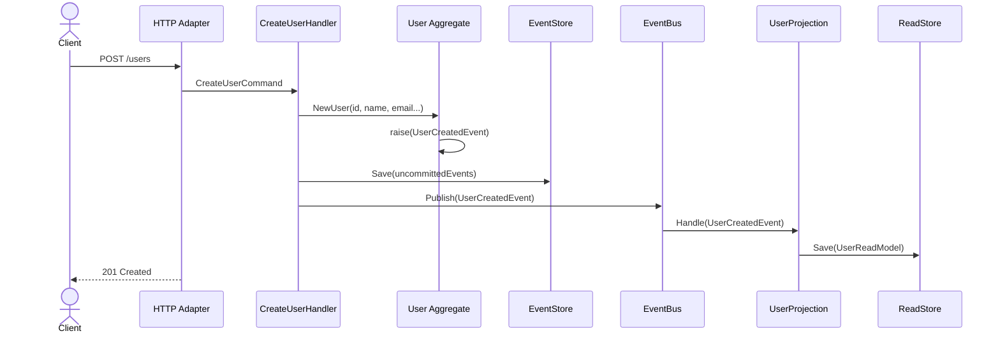
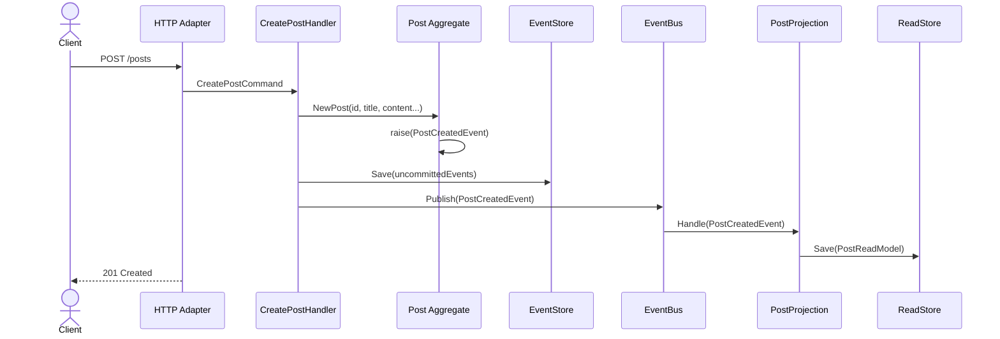
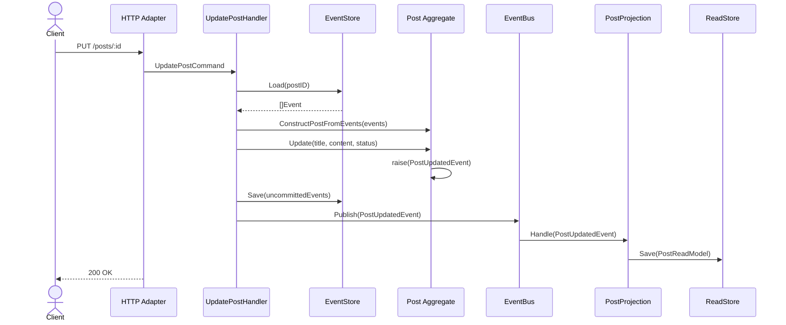
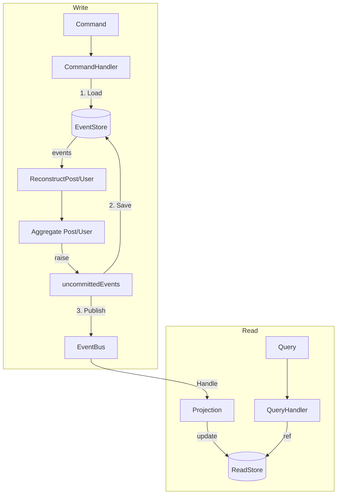
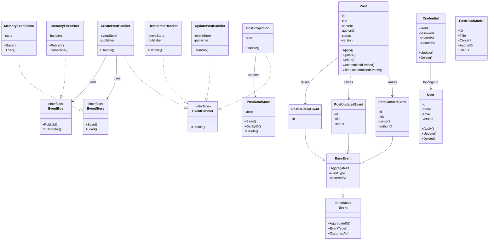

# CQRS + Event Sourcing

## シーケンス図

### ユーザー登録

```mermaid
sequenceDiagram
    actor Client
    participant HTTP as HTTP Adapter
    participant Handler as CreateUserHandler
    participant Aggregate as User Aggregate
    participant ES as EventStore
    participant EB as EventBus
    participant Proj as UserProjection
    participant RS as ReadStore

    Client->>HTTP: POST /users
    HTTP->>Handler: CreateUserCommand
    Handler->>Aggregate: NewUser(id, name, email...)
    Aggregate->>Aggregate: raise(UserCreatedEvent)
    Handler->>ES: Save(uncommittedEvents)
    Handler->>EB: Publish(UserCreatedEvent)
    EB->>Proj: Handle(UserCreatedEvent)
    Proj->>RS: Save(UserReadModel)
    HTTP-->>Client: 201 Created
```

### 投稿作成

```mermaid
sequenceDiagram
    actor Client
    participant HTTP as HTTP Adapter
    participant Handler as CreatePostHandler
    participant Aggregate as Post Aggregate
    participant ES as EventStore
    participant EB as EventBus
    participant Proj as PostProjection
    participant RS as ReadStore

    Client->>HTTP: POST /posts
    HTTP->>Handler: CreatePostCommand
    Handler->>Aggregate: NewPost(id, title, content...)
    Aggregate->>Aggregate: raise(PostCreatedEvent)
    Handler->>ES: Save(uncommittedEvents)
    Handler->>EB: Publish(PostCreatedEvent)
    EB->>Proj: Handle(PostCreatedEvent)
    Proj->>RS: Save(PostReadModel)
    HTTP-->>Client: 201 Created
```

### 投稿更新

```mermaid
sequenceDiagram
    actor Client
    participant HTTP as HTTP Adapter
    participant Handler as UpdatePostHandler
    participant ES as EventStore
    participant Aggregate as Post Aggregate
    participant EB as EventBus
    participant Proj as PostProjection
    participant RS as ReadStore

    Client->>HTTP: PUT /posts/:id
    HTTP->>Handler: UpdatePostCommand
    Handler->>ES: Load(postID)
    ES-->>Handler: []Event
    Handler->>Aggregate: ConstructPostFromEvents(events)
    Handler->>Aggregate: Update(title, content, status)
    Aggregate->>Aggregate: raise(PostUpdatedEvent)
    Handler->>ES: Save(uncommittedEvents)
    Handler->>EB: Publish(PostUpdatedEvent)
    EB->>Proj: Handle(PostUpdatedEvent)
    Proj->>RS: Save(PostReadModel)
    HTTP-->>Client: 200 OK
```

## アーキテクチャフロー

```mermaid
graph TD
    subgraph Write
        CMD[Command] --> CH[CommandHandler]
        CH -->|1. Load| ES[(EventStore)]
        ES -->|events| RC[ReconstructPost/User]
        RC --> AGG[Aggregate Post/User]
        AGG -->|raise| UE[uncommittedEvents]
        UE -->|2. Save| ES
        UE -->|3. Publish| EB[EventBus]
    end

    subgraph Read
        EB -->|Handle| PROJ[Projection]
        PROJ -->|update| RS[(ReadStore)]
        QH[QueryHandler] -->|ref| RS
        QRY[Query] --> QH
    end
```

## クラス図

```mermaid
classDiagram
    class Event {
        <<interface>>
        +AggregateID()
        +EventType()
        +OccurredAt()
    }
    class BaseEvent {
        +AggregateID
        -eventType
        -occurredAt
    }
    class EventStore {
        <<interface>>
        +Save()
        +Load()
    }
    class EventBus {
        <<interface>>
        +Publish()
        +Subscribe()
    }
    class EventHandler {
        <<interface>>
        +Handle()
    }
    class Post {
        -id
        -title
        -content
        -authorID
        -status
        -version
        +Apply()
        +Update()
        +Delete()
        +UncommittedEvents()
        +ClearUncommittedEvents()
    }
    class PostCreatedEvent {
        -id
        -title
        -content
        -authorID
    }
    class PostUpdatedEvent {
        -id
        -title
        -status
    }
    class PostDeletedEvent {
        -id
    }
    class User {
        -id
        -name
        -email
        -version
        +Apply()
        +Update()
        +Delete()
    }
    class Credential {
        -userID
        -password
        -createdAt
        -updatedAt
        +Update()
        +Delete()
    }
    class CreatePostHandler {
        -eventStore
        -publisher
        +Handle()
    }
    class UpdatePostHandler {
        -eventStore
        -publisher
        +Handle()
    }
    class DeletePostHandler {
        -eventStore
        -publisher
        +Handle()
    }
    class MemoryEventStore {
        -store
        +Save()
        +Load()
    }
    class MemoryEventBus {
        -handlers
        +Publish()
        +Subscribe()
    }
    class PostProjection {
        -store
        +Handle()
    }
    class PostReadStore {
        -store
        +Save()
        +GetByID()
        +Delete()
    }
    class PostReadModel {
        +ID
        +Title
        +Content
        +AuthorID
        +Status
    }

    BaseEvent ..|> Event
    PostCreatedEvent --|> BaseEvent
    PostUpdatedEvent --|> BaseEvent
    PostDeletedEvent --|> BaseEvent
    Post --> PostCreatedEvent : raises
    Post --> PostUpdatedEvent : raises
    Post --> PostDeletedEvent : raises
    Credential --> User : belongs to
    CreatePostHandler ..|> EventHandler
    UpdatePostHandler ..|> EventHandler
    DeletePostHandler ..|> EventHandler
    MemoryEventStore ..|> EventStore
    MemoryEventBus ..|> EventBus
    PostProjection ..|> EventHandler
    CreatePostHandler --> EventStore : uses
    CreatePostHandler --> EventBus : uses
    PostProjection --> PostReadStore : updates
```
